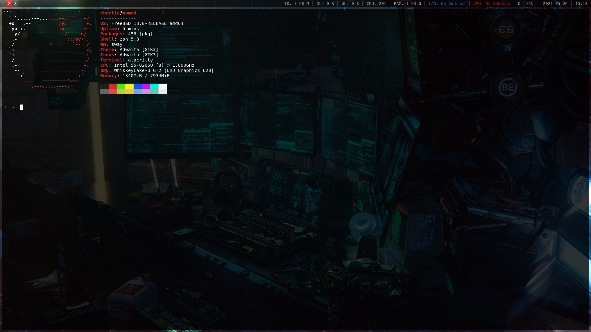

# freebsd-playbook

[](https://github.com/charlesrocket/freebsd-playbook/actions)
[](https://cirrus-ci.com/github/charlesrocket/freebsd-playbook)

**FreeBSD** & **sway**

```sh
curl https://raw.githubusercontent.com/charlesrocket/freebsd-playbook/master/bootstrap | sh
```
🚧
