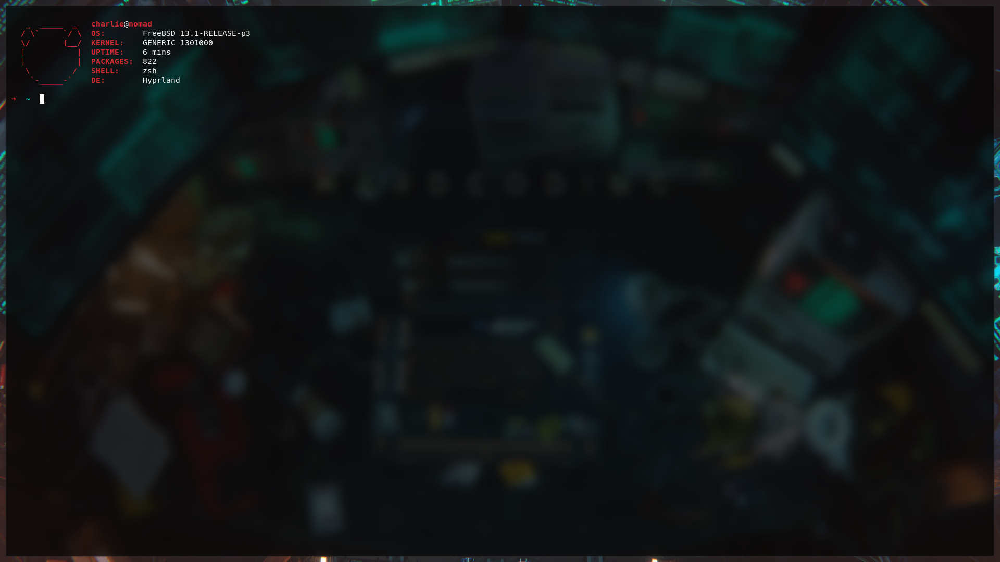

# freebsd-station
[](https://github.com/charlesrocket/freebsd-station/actions)
[](https://cirrus-ci.com/github/charlesrocket/freebsd-station)



**FreeBSD** station

```sh
curl https://raw.githubusercontent.com/charlesrocket/freebsd-station/master/bootstrap | sh
```
🚧
